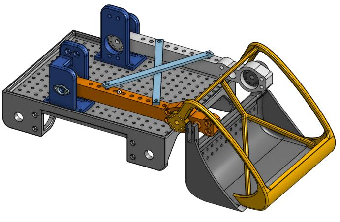
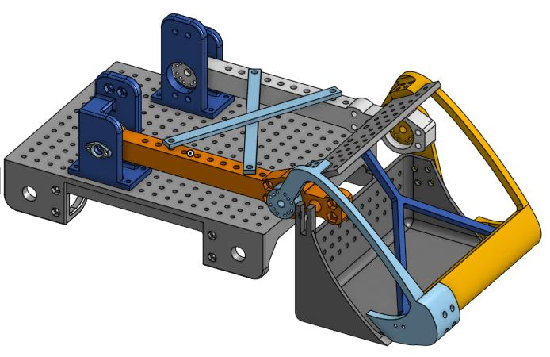
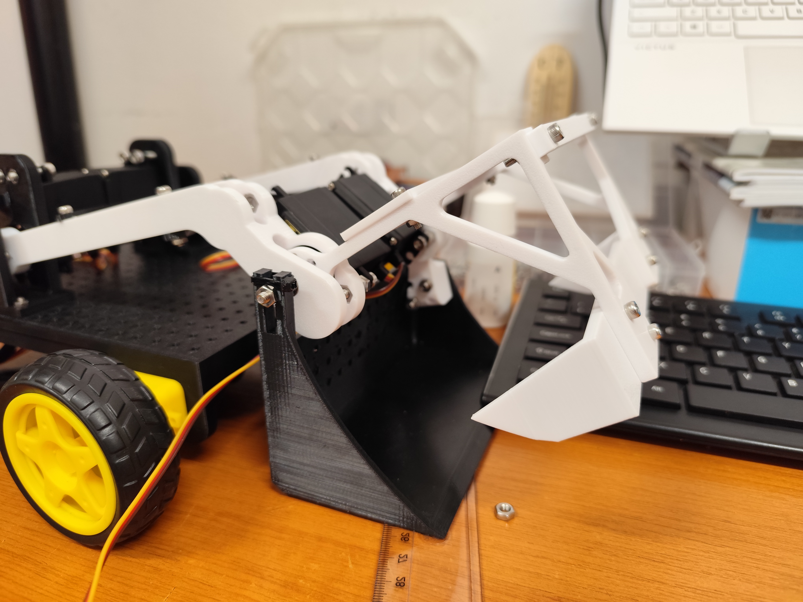
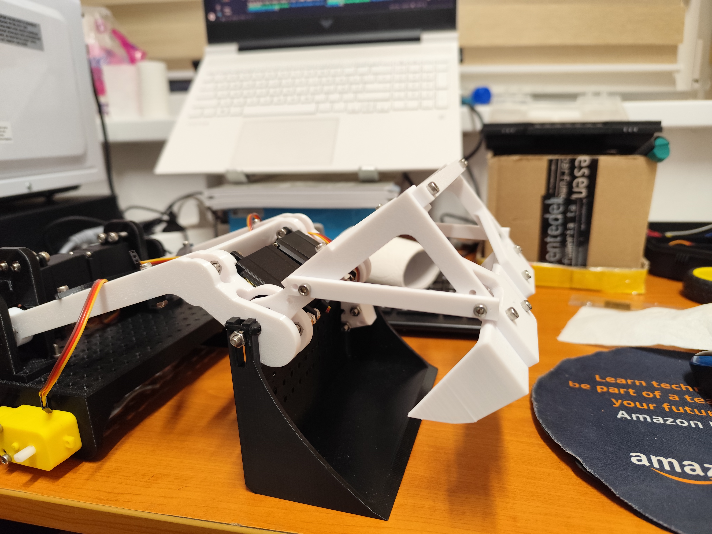
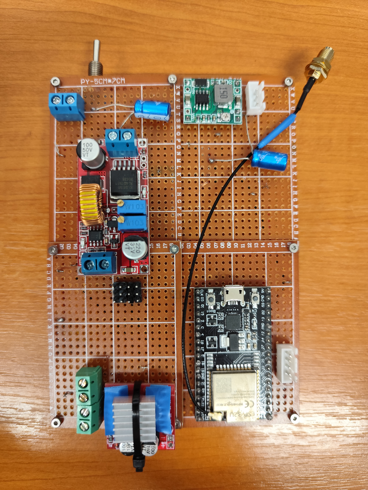
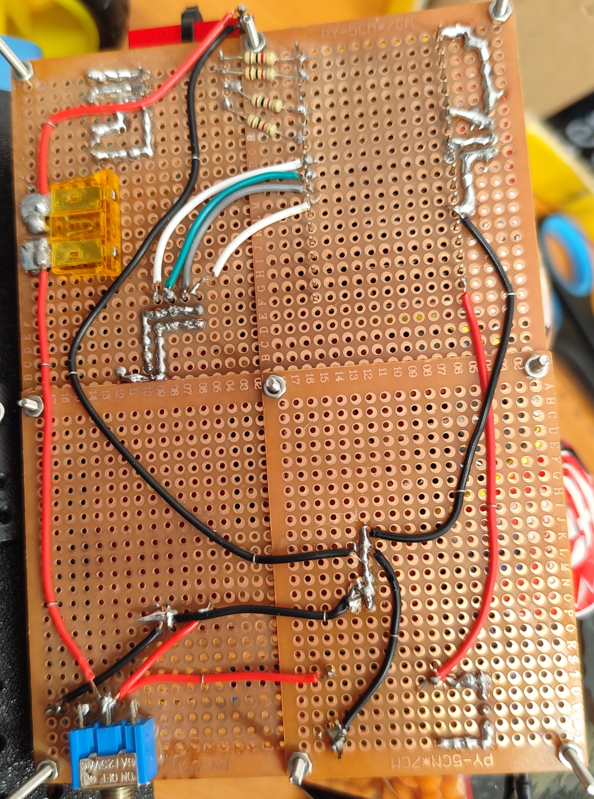
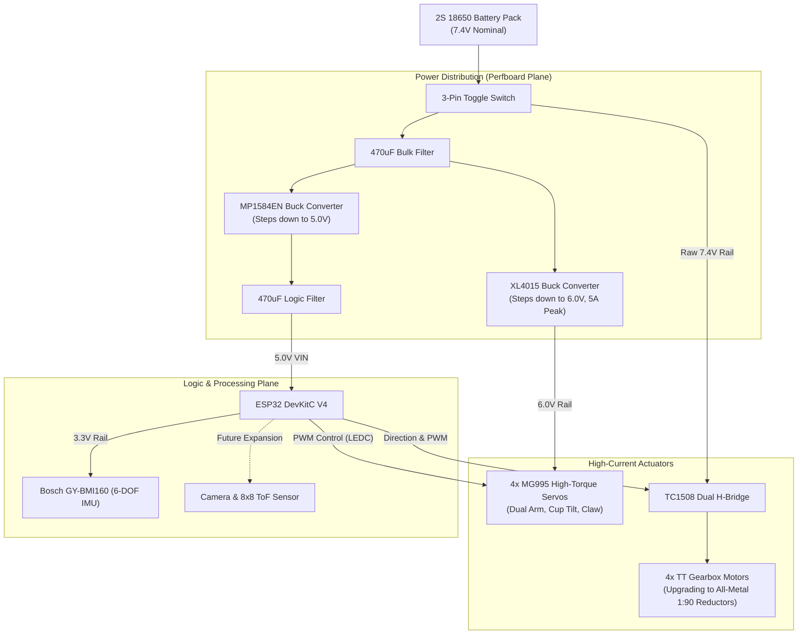

# Autonomous Claw Bulldozer ROS 2 Workspace

An autonomous manipulation and earth-moving platform featuring a multi-axis articulating high-torque claw and bucket mechanism, 4WD skid-steer chassis, ESP32 dual-core real-time control, onboard IMU pose tracking, and ROS 2 Jazzy integration.

> 📦 **Hardware Heritage & Lineage Notice:** Core electronics (ESP32 DevKitC, TC1508 H-bridge, GY-BMI160 6-DOF IMU, buck converters) and the baseline micro-ROS architecture were harvested and evolved from the decommissioned [Mihaii2/esp32_bulldozer](https://github.com/Mihaii2/esp32_bulldozer).

<div align="center">
  <table>
    <tr>
      <td align="center" width="25%">
        <br/>
        <b>Revision 1: Organic Lattice</b><br/>
        <em>3D round skeleton claw; discarded due to massive support waste and print cost.</em>
      </td>
      <td align="center" width="25%">
        <br/>
        <b>Revision 2: Split Axis Failure</b><br/>
        <em>Cheaper multi-part claw, but non-concentric pivot axes and horn bolt misalignments failed grip lock.</em>
      </td>
      <td align="center" width="25%">
        <br/>
        <b>Revision 3: Compliant Beams</b><br/>
        <em>Concentric claw/cup axis resolved kinematics, but thin support arms caused excessive structural flex.</em>
      </td>
      <td align="center" width="25%">
        <br/>
        <b>Revision 4: Rigid Production</b><br/>
        <em>Reinforced structural beam geometry; eliminates claw deflection and locks payload into collection cup.</em>
      </td>
    </tr>
  </table>
</div>

> **🛠 Engineering Revision History & CAD Iteration Log:**
> * **v1.0 (Organic Monolithic Claw):** Claw designed as a continuous 3D organic round skeleton. While lightweight on paper, slicer analysis proved it unviable for FDM printing: massive support structures consumed more filament than the part itself, driving print failure rates and material cost excessively high.
> * **v2.0 (Modular Shell & The Pivot Misalignment Post-Mortem):** Redesigned the claw into flat-laying, easily printable structural components, as well as redesigning the chassis goussets to get rid of a lot of waste support plastic. However, rapid CAD prototyping introduced two major mechanical flaws:
>   * **Axial Offset:** The bucket/cup swing axis and the claw rotation axis were placed on disparate coordinate planes rather than a single concentric shaft. The mechanical offset degraded clamping reach, making object acquisition unreliable.
>   * **Horn Geometry Error:** Servo horn mounting hole pitch and bolt clearances were mismeasured, preventing secure mechanical torque transfer without binding.
> * **v3.0 (Concentric Axis & Structural Compliance Investigation):** Redesigned the mounting hub to align the cup and claw along a shared, concentric pivot axis. The mechanical geometry functioned correctly, but the claw extension beams were undersized in thickness. Clamping torque from the MG995 servos flexed the beams outward rather than transferring grip pressure into the target object.
> * **v4.0 (Rigid Structural Reinforcement — Current Hardware):** Completely re-engineered the claw support beams with increased cross-sectional area and internal ribbing. Flex is eliminated, permitting high-torque payload capture and retraction directly into the retention cup.
> * **v4.1 (Locomotion Tuning & Track/Wheel Calibration):**
>   * **Wheel Dimensional Scaling:** Replaced oversized 45mm-radius wheel collisions with realistic 20mm-radius (40mm diameter) hubs recessed directly into the chassis axle slots for accurate Gazebo physics and ground clearance.
>   * **Pivot & Scrubbing Firmware Mitigation:** Tuned the differential drive turning profile across all speed gears to supply 100% PWM (255) to the outside wheels and 0% PWM to the inside wheels during turns, breaking lateral static friction without stalling the motors.
>   * **Drivetrain Upgrade Roadmap:** Standard yellow plastic TT gearboxes have been purchased and are slated for replacement with **all-metal TT 1:90 reduction gearboxes**, delivering the necessary low-end torque for heavy earth-moving without gear-tooth shear.
> * **v5.0 (Perception & Spatial Autonomy Roadmap):** Integrating a wrist/overhead camera mount alongside an **8×8 Time-of-Flight (ToF) multi-zone distance array** mounted directly above the claw for depth mapping, edge tracking, and target classification.

---

## 🖧 Custom Perfboard Motherboard & Fabrication

Custom hand-soldered point-to-point perfboard centralizing the logic processing, power distribution, and actuation buses:

<div align="center">
  <table>
    <tr>
      <td align="center" width="50%">
        <br/>
        <b>Component Plane (Top Side)</b><br/>
        <em>ESP32 DevKit socket, MP1584EN & XL4015 buck modules, 470µF rail caps, TC1508 driver, and servo headers.</em>
      </td>
      <td align="center" width="50%">
        <br/>
        <b>Trace & Solder Plane (Bottom Side)</b><br/>
        <em>Reinforced high-current ground plane, bus routing, logic decoupling, and direct solder bridges.</em>
      </td>
    </tr>
  </table>
</div>

---

## 🧩 Bill of Materials (BOM)

### Current Build (v4.0 Autonomous Claw Platform)

| Component / Module | Specification / Model | Qty | Description / Role |
|---|---|---|---|
| **Microcontroller** | ESP32 DevKitC V4 (SuooTci / USB) | 1 | Core logic, FreeRTOS tasks, PWM Generation, I2C IMU polling & Micro-ROS bridge |
| **IMU Sensor** | Bosch GY-BMI160 (6-DOF) | 1 | 3-axis gyro + 3-axis accelerometer for chassis orientation and terrain profiling |
| **Motor Driver** | TC1508 / MX1508 Dual H-Bridge | 1 | 3.3V logic-compatible 4-channel DC driver ($2.0\text{V} - 9.6\text{V}$, $1.5\text{A}$ peak/ch) |
| **DC Drive Motors** | TT Gearbox DC Motors (3V–9V) | 4 | Chassis locomotion (2x Left, 2x Right wired in parallel pairs; *pending upgrade to all-metal TT 1:90 reductors*) |
| **High-Torque Servos** | TowerPro MG995 Metal-Gear | 4 | Heavy actuation: Arm lift (dual synced), bucket/cup tilt, and claw grip |
| **Logic Step-Down** | MP1584EN Buck Converter | 1 | Regulates 7.4V battery pack down to stable 5.0V for ESP32 VIN |
| **Servo Step-Down** | XL4015 High-Current Buck Converter | 1 | High-capacity DC-DC step down (7.4V to 6.0V, $\ge 5\text{A}$) dedicated to MG995 servos |
| **Power Decoupling Caps**| $470\,\mu\text{F}$ Electrolytic ($\ge 16\text{V}$) | 2 | Inductive spike and brownout protection (1x on 7.4V battery rail, 1x on 5.0V logic rail) |
| **Main Battery** | 18650 Li-ion Cells (2S / 7.4V Nominal) | 2 | Main power source for locomotion, logic, and servo banks |
| **Main Power Switch** | Mini 3-Pin SPDT Toggle Switch | 1 | Master battery circuit cutoff switch |
| **Vision Sensor (Roadmap)** | Onboard Camera Module | 1 | Forward-facing object recognition and path planning |
| **Depth Sensor (Roadmap)** | 8x8 Multizone ToF Matrix Sensor | 1 | Surface profiling and short-range claw docking validation |

---

### Legacy Hardware Donor: [Mihaii2/esp32_bulldozer](https://github.com/Mihaii2/esp32_bulldozer)

| Component / Module | Specification / Model | Qty | Status in Current Project |
|---|---|---|---|
| **Microcontroller** | ESP32 DevKitC V4 | 1 | **Migrated:** Re-flashed with manipulator kinematics and 4-channel servo control. |
| **Motor Driver** | TC1508 Dual H-Bridge | 1 | **Migrated:** Retained for 4-wheel skid-steer chassis locomotion. |
| **DC Motors** | TT Gearbox DC Motors (3V–9V) | 4 | **Migrated:** Reused for chassis drive train (*all-metal 1:90 units purchased for replacement*). |
| **IMU Sensor** | Bosch GY-BMI160 (6-DOF) | 1 | **Migrated:** Shifted from balance control to kinematic leveling and terrain detection. |
| **Filter Capacitors** | $470\,\mu\text{F}$ Electrolytic ($\ge 16\text{V}$) | 2 | **Migrated:** Retained for dual-rail bus filtering. |
| **Buck Converter** | MP1584EN | 1 | **Migrated:** Retained as dedicated logic rail regulator. |
| **Tilt Switch** | SW-520D Ball Switch | 1 | **Deprecated:** Retired in favor of 6-DOF IMU telemetry. |
| **Dynamic Inversion Logic**| Auto-Flip Firmware Controller | — | **Deprecated:** Replaced by kinematic trajectory control for arm and bucket. |

---

## 🛠 Features
- **Articulated High-Torque Clamping:** 4× MG995 servos providing dual-arm lifting, cup tilting, and active payload grabbing.
- **Dual-Rail Isolated Power Distribution:** High-current XL4015 buck converter isolates heavy servo inductive back-EMF from the ESP32 logic rail.
- **Calibrated Skid-Steer Kinematics:** Asymmetrical 100/0 PWM steering regime breaks track scrubbing, supplemented by 20mm scale-matched wheel collisions.
- **Concentric Axis Kinematics:** Revision 4 unibody geometry maintains zero rotational shear between retention cup and claw swing arcs.
- **Native Micro-ROS Integration:** ESP32 communicates deterministic low-latency telemetry and joint states natively to ROS 2 Jazzy over XRCE-DDS.
- **Dual-Core FreeRTOS Execution:** Decoupled architecture isolating high-speed I2C sensor/PWM routines from network communication.

---

## 🔌 Hardware Architecture & Power Routing



---

## ⚡ Hardware Pinout (ESP32)

Unified GPIO allocation across motor drive stages, servo PWM channels, and sensor buses:

| Subsystem | Component Pin | ESP32 GPIO / Rail | Peripheral / Channel | Function / Calibration Limits |
|---|---|---|---|---|
| **DC Drive (TC1508)** | `IN1` | `GPIO 23` | GPIO Output / LEDC | Right Track Motor (Direction A) |
| **DC Drive (TC1508)** | `IN2` | `GPIO 22` | GPIO Output / LEDC | Right Track Motor (Direction B) |
| **DC Drive (TC1508)** | `IN3` | `GPIO 21` | GPIO Output / LEDC | Left Track Motor (Direction A) |
| **DC Drive (TC1508)** | `IN4` | `GPIO 19` | GPIO Output / LEDC | Left Track Motor (Direction B) |
| **Servos (MG995)** | Arm Base Left | `GPIO 18` | `LEDC_CHANNEL_0` | `132.0°` (Down / 0%) to `44.0°` (Up / 100%) |
| **Servos (MG995)** | Arm Base Right | `GPIO 5` | `LEDC_CHANNEL_1` | `40.0°` (Down / 0%) to `124.0°` (Up / 100%) *(Mirrored sync)* |
| **Servos (MG995)** | Cup / Wrist Tilt | `GPIO 17` | `LEDC_CHANNEL_2` | Independent Pitch Mechanism |
| **Servos (MG995)** | Claw Gripper | `GPIO 16` | `LEDC_CHANNEL_3` | Independent Grip / Release Mechanism |
| **IMU (BMI160)** | `SCL` | `GPIO 32` | `I2C_NUM_0` SCL | Hardware I2C Clock Line |
| **IMU (BMI160)** | `SDA` | `GPIO 25` | `I2C_NUM_0` SDA | Hardware I2C Data Line |
| **IMU (BMI160)** | `CS` / `SA0` | `3.3V Rail` | Logic High | Forces I2C Mode / Sets Address to `0x69` |

> *Note: All MG995 servos utilize `LEDC_TIMER_0` configured for 50 Hz PWM with 14-bit resolution.*

---

## 🚀 Getting Started

### Prerequisites
- Ubuntu 22.04 / 24.04
- ROS 2 (Jazzy / Humble)
- ESP-IDF v5.2+
- Docker (for micro-ROS agent)

```bash
### Build & Run
# Clone and enter workspace
cd ~/ROS_projects/claw_bulldozer_ws

# Build the ROS 2 packages
colcon build --symlink-install

# Source the overlay
source install/setup.bash

# Run main bringup script
./run.sh

# Source ESP-IDF environment
. $HOME/esp/esp-idf/export.sh

# Navigate to firmware project
cd ~/ROS_projects/claw_bulldozer_ws/firmware/flipper_firmware

# Build, flash to ESP32, and launch UART monitor
idf.py build flash monitor

# Start micro-ROS Agent (in separate terminal)
docker run -it --rm --net=host microros/micro-ros-agent:jazzy udp4 --port 8888
```